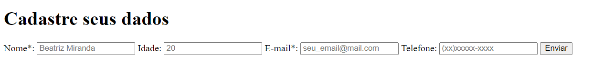
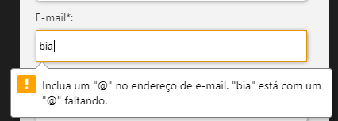
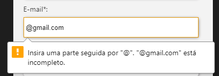
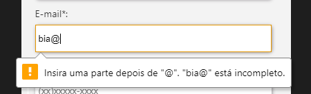

# Criando Formulários em HTML5

No desenvolvimento algo que é sempre pedido é a criação de formulários, uma vez que não há melhor maneira de obter informações do usuário do que um bom `<input/>`. E nesse artigo consiste na apresentação de tags HTML5 utilizadas para desenvolver formulários.

O formulário apresentado será simples, pois não é o foco apresentar conteúdo sobre o nível de segurança e confiabilidade, ou conexão com o banco de dados, mas sim apresentar layouts utilizando do `HTML` e `CSS`.

<hr />

## HTML5

O [HTML5](https://www.w3.org/TR/html52/) trouxe maneiras para validar campos de uma forma mais simplificada e também novos tipos de `input` que facilitam muito o desenvolvimento de um formulário.

Com isso podemos escrever um formulário básico com os seguintes comandos:

```html
<form name="userInfo_form">
  <h1>Cadastre seus dados</h1>

  <label for="nome">Nome*: </label>
  <input type="text" name="nome" id="nome" placeholder="Beatriz Miranda" required />

  <label for="idade">Idade: </label>
  <input type="number" id="idade" placeholder="20" name="idade" />

  <label for="email">E-mail*: </label>
  <input type="email" id="email" placeholder="seu_email@mail.com" name="email" required />

  <label for="phone">Telefone: </label>
  <input type="tel" id="phone" placeholder="(xx)xxxxx-xxxx" name="phone" />

  <input type="submit" class="enviar" onclick="sendForm();" value="Enviar" />
</form>
```

O resultado será algo parecido com isso:

<div  class="centerImg">

</div>

## CSS3

Mas para que seu formulário seja bem estilizado podemos utilizar [CSS3](https://www.w3.org/TR/2001/WD-css3-roadmap-20010523/). E para isso precisamos de um arquivo css externo e importá-lo no começo de seu html com a tag abaixo, lembre-se de referencar o caminho adequado para o arquivo.

```html
<link rel="stylesheet" href="./css/styles.css" />
```

e então podemos começar o css com alguns estilos:

```css
form {
  color: #333;
  display: flex;
  padding: 20px;
  max-width: 350px;
  margin: 20px auto;
  border-radius: 5px;
  background: #f3f3f3;
  flex-direction: column;
}
input {
  width: 95%;
  height: 30px;
  padding: 5px;
  border: none;
  border-radius: 5px;
  box-shadow: 1px 1px 5px #969296;
}
input[type="submit"] {
  width: auto;
  color: white;
  margin-left: auto;
  background-color: #bd24bd;
}
label {
  display: block;
  margin-bottom: 5px;
}
```

e finalmente o resultado final é esse aqui:

<form name="userInfo_form" onsubmit="sendForm();" >
  <h1>Cadastre seus dados</h1>

<label for="nome">Nome\*: </label>
<input type="text" name="nome" id="nome" placeholder="Beatriz Miranda" required />

<label for="idade">Idade: </label>
<input type="number" id="idade" placeholder="20" name="idade" min="0" />

<label for="email">E-mail\*: </label>
<input type="email" id="email" placeholder="seu_email@mail.com" name="email" required />

<label for="phone">Telefone: </label>
<input type="tel" id="phone" placeholder="(xx)xxxxx-xxxx" name="phone" pattern="\([0-9]{2}\)[0-9]{5}-[0-9]{4}" />

  <input type="submit" class="enviar" value="Enviar" />
</form>

<hr style="margin-top: 50px"/>

# Vamos explicar o que aconteceu aqui

## Inputs

O primeiro input utilizado foi o mais comum o tipo `text` ele é um input simples de uma linha de texto.

Mas nele utilizamos o **atributo `required`** esse atributo serve para que o formulário não possa sem enviado sem que esse campo seja preenchido.

```html
<input type="text" required />
```

O próximo input utilizado foi o de tipo `number` ele apenas recebe valores numéricos e possui atributos específicos como, `min` e `max` que determina o valor mínimo e máximo que pode ser inserido nesse campo.

```html
<input type="number" name="idade" min="0" max="100" />
```

Utilizado também o input do tipo `email` que faz algumas validações simples para permitir que esse campo possa ser enviado, como a existência de um `@` e conteúdo antes e depois desse caracter.

```html
<input type="email" />
```

Exemplo de erro com o campo de `email`:

<div  class="centerImg">



</div>

E utilizamos o input do tipo `tel` que semanticamente informa que esse input receberá um número de telefone, no entanto como há diversos padrões de número de telefone ao redor do mundo esse input não tem uma validação própria sendo necessário usar o atributo `pattern` para forçar um padrão.

```html
<input type="tel" pattern="\([0-9]{2}\)[0-9]{5}-[0-9]{4}" />
```

### Patter

Rapidamente explicando o pattern utiliza [Regex](https://regexr.com/).
E no padrão do input acima verifica se o valor do input começa com um `(` se possui dois números entre 0 e 9 seguido por um `)`

```js
\([0-9]{2}\)
```

e então se ele possui mais 5 digitos de 0 a 9 seguido por um `-` e mais 4 digitos também de 0 a 9.

```js
[0-9]{5}-[0-9]{4}
```

E por fim utilizamos o `input` que deve ser sempre encontrado nos formulários, o de tipo `submit` que tem um formato de botão e quando clicado triga um onSubmit do tag `form`. Ou seja no exemplo abaixo quando o input de `submit` for precionado e todos os campos do formulários estiverem corretamente preenchidos a função `sendForm()` será executada.

```html
<form name="userInfo_form" onsubmit="sendForm()">
  <input type="submit" value="Enviar" />
</form>
```

# Conclusão

Com a entrada do `HTML5` os formulários se tornaram muito mais simples de serem desenvolvidos. Contendo diversos tipos diferentes de input que podem ser facilmente adicionados ao `HTML` de seu sistema. Mais tipos de input podem ser encontrados no site da nossa querida [W3Schools](https://www.w3schools.com/html/html_form_input_types.asp)

Lembrando que no quesito de segurança, obtenção, armazenamento e envio desses dados sejam necessários outras linguagens como `javascript`, `PHP` e provavelmente um banco de dados.

<style>
  form {
    color: #333;
    display: flex;
    padding: 20px;
    max-width: 350px;
    margin: 20px auto;
    border-radius: 5px;
    background: #f3f3f3;
    flex-direction: column;
  }
  input {
    width: 95%;
    height: 30px;
    padding: 5px;
    border: none;
    border-radius: 5px;
    box-shadow: 1px 1px 5px #969296;
  }
  input[type="submit"] {
    width: auto;
    color: white;
    margin-left: auto;
    background-color: #bd24bd;
  }
  label {
    display: block;
    margin-bottom: 5px;
  }
  .centerImg {
    display: flex; 
    justify-content: center;
    margin: 40px 0;
    flex-wrap: wrap;
  }
</style>
